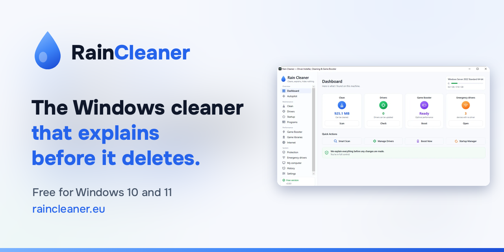
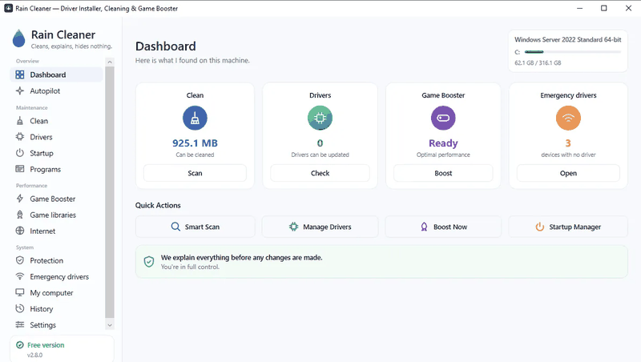
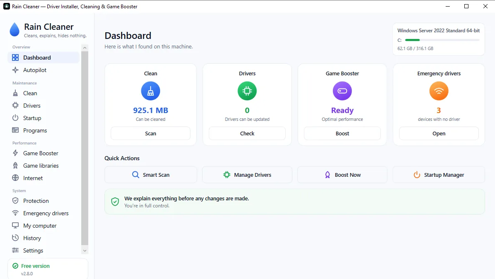
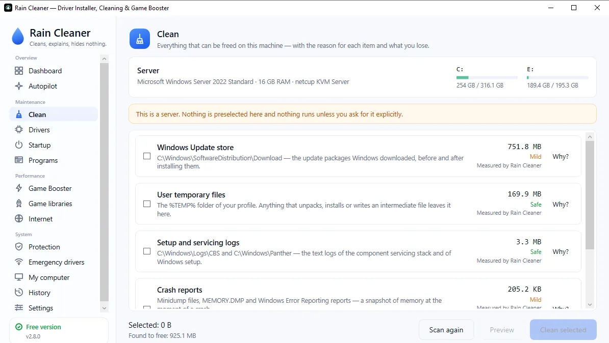
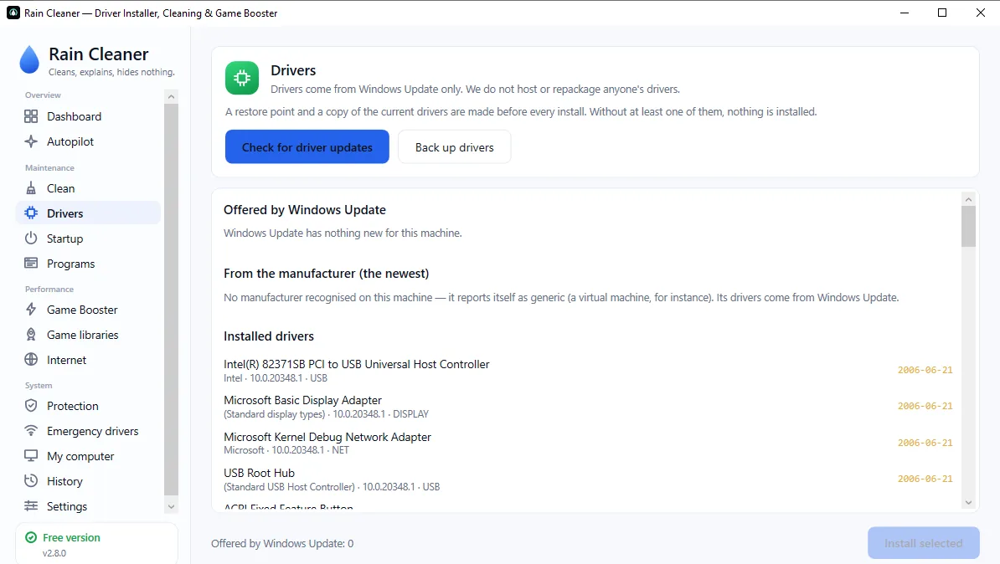
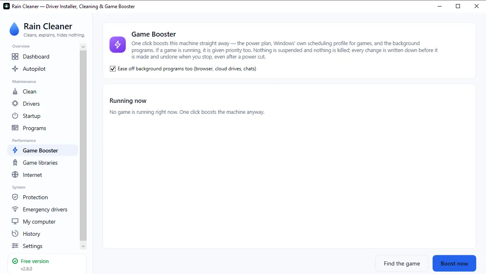
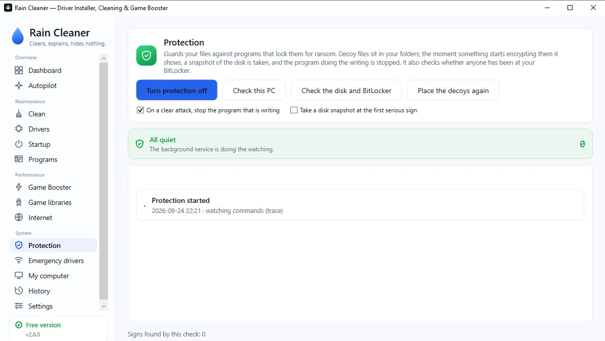
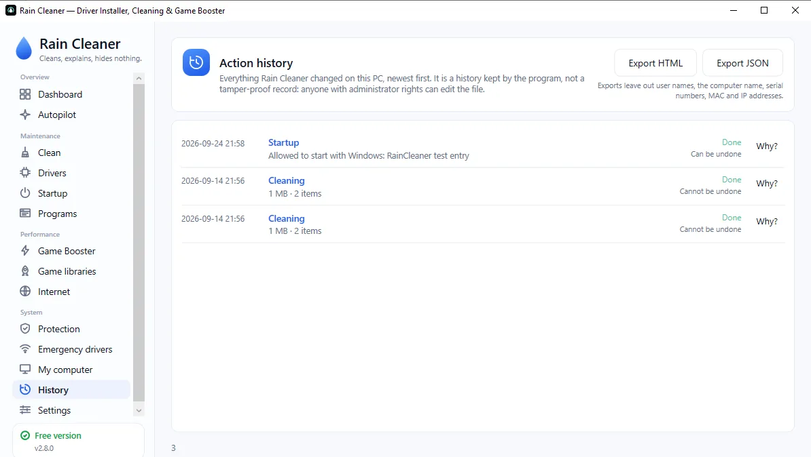

  

<h1 align="center">Rain Cleaner</h1>

  <b>Cleans, explains, hides nothing.</b> 
  A free cleaner, driver installer, game booster and ransomware guard for Windows 10 and 11.

  
  
  
  
  
  
  

---

Every cleaner for Windows shows you a number and a big button. None of them tells you what
you are about to lose.

Rain Cleaner checks what is taking up space, which drivers are out of date and what starts
with Windows. Then it shows you what it found **and why**. You decide what changes, and the
history lets you undo it.

**[raincleaner.eu](https://raincleaner.eu)** — the site and the program speak six languages
(English, Български, Deutsch, Español, Русский, Türkçe).

  

## What it does

| | |
|---|---|
| **Cleaning** | Finds files that take up space for no good reason, with an explanation for every item. Every Chrome, Edge and Brave profile is covered. |
| **Drivers** | Takes drivers from Microsoft's catalogue. If the manufacturer has a newer one, it says so. A restore point comes first. |
| **Game booster** | Frees resources while you play, then puts every setting back. Never suspends or kills a process. |
| **Emergency drivers** | Gets the network working again on a PC that cannot get online. |
| **Ransomware protection** | Decoy files in your folders catch encryption early. Not an antivirus, and not sold as one. |
| **Internet** | Measures which DNS servers answer fastest, in milliseconds. |
| **Action history** | Everything the program changed, with a redacted export you can share when asking for help. |

## What it does **not** do

- **It is not an antivirus.** No virus database, no replacement for yours. It watches behaviour, not known files.
- **It does not speed up your internet.** That comes from your provider. It can measure DNS and help you pick a faster one — that part is visible in milliseconds.
- **It is not code-signed yet.** Windows will say "unknown publisher" about the installer, as it does about every unsigned one. If you would rather skip that screen, take the portable version.

## Install

| | |
|---|---|
| **Installer** | [raincleaner.eu/download](https://raincleaner.eu/download) or the [latest release](https://github.com/raincleaner/RainCleaner/releases/latest) — also sets up the scheduled cleaning service |
| **Portable** | [raincleaner.eu/download/portable](https://raincleaner.eu/download/portable) — no installer, so no warning screen |
| **WinGet** | `winget install TVasilev.RainCleaner` |
| **Chocolatey** | `choco install raincleaner` |

Windows 10, Windows 11 and Windows Server, 64-bit. About 65 MB. The free version needs no account.
Every release lists its SHA-256, so you can confirm you got the file we built — the
[Trust Center](https://raincleaner.eu/trust) shows the current one together with the latest
Microsoft Defender scan.

## Screenshots

| | |
|---|---|
|  |  |
|  |  |
|  |  |

## Free and Pro

Everything listed above is free, for as long as the program exists. **Pro** is optional and adds
actions and automation: Fix My PC, Make My PC Faster, Never Run Out of Space, Update Everything,
Undo Anything, all drivers at once and the scheduled autopilot. Monthly, yearly or once —
[pricing](https://raincleaner.eu/pricing). Try it free for 7 days from the Pro screen: no card, nothing renews.

## Privacy

The program makes exactly **two** kinds of network request, both written out at
[raincleaner.eu/privacy](https://raincleaner.eu/privacy): a check for a new version, and
activating a Pro key — only if you enter one. No analytics, no telemetry.

## Community and help

- **Discord:** [discord.gg/KykZ9t8RwM](https://discord.gg/KykZ9t8RwM)
- **Forum:** [raincleaner.eu/community](https://raincleaner.eu/community)
- **Facebook:** [Rain Cleaner](https://www.facebook.com/1279115171954428)
- **Bugs and ideas:** [open an issue](https://github.com/raincleaner/RainCleaner/issues/new/choose) or start a [discussion](https://github.com/raincleaner/RainCleaner/discussions)

## About this repository

This repository hosts **releases, the changelog, the Chocolatey package and the issue tracker**.
Rain Cleaner is freeware; the source is not public. See [LICENSE](LICENSE),
[CHANGELOG](CHANGELOG.md) and [SECURITY](SECURITY.md).

### Verified downloads

Only download Rain Cleaner from:

- ✓ [raincleaner.eu](https://raincleaner.eu/download)
- ✓ [GitHub Releases](https://github.com/raincleaner/RainCleaner/releases) of this repository
- ✓ Microsoft WinGet — `TVasilev.RainCleaner`
- ✓ Chocolatey — `raincleaner`

Copies anywhere else — especially "Pro" or "portable Pro" builds — have been modified by someone else and are not ours.

Written and maintained by **T. Vasilev** · [support@raincleaner.eu](mailto:support@raincleaner.eu)
